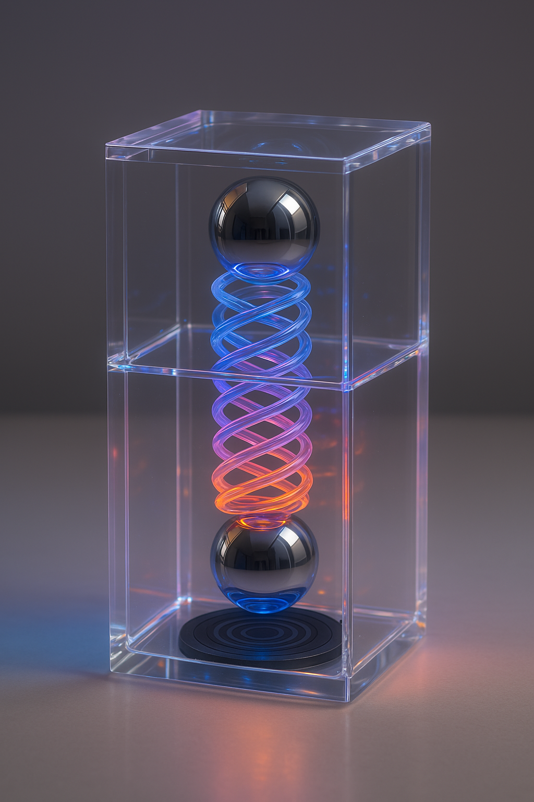

# Casting and Assembly Guide

> © 2025 Professor. Damian A. James Williamson Grad. & Microsoft Copilot  
> Part of the *Epoxy Resonance Monolith* project. Licensed under MIT.

---

This guide outlines the physical construction methods used to bring the Monolith to life: from mold prep to epoxy pour to internal alignment.

---

## 📏 Final Form

- **External Dimensions**: 8" × 8" × 16"
- **Material**: UV-stable crystal-clear epoxy
- **Wall Structure**: One continuous body with optional access base panel

---

## 🧱 Mold Design

Use a two-part mold constructed from:
- Silicone for side cavity and release
- Mold box from acrylic or MDF
- Cavity supports for:
  - Top and bottom speaker spheres
  - LED rings
  - Quad helix coils
  - Charging coil and electronics

Optional: Add vent channels or pour funnel structure.

---

## 🧲 Internal Alignment

- Suspend components with:
  - Nylon thread and pins
  - 3D-printed alignment scaffolds
  - Magnetic positioners embedded into mold base
- Use tape, shrink tubing, or silicone epoxy to seal wires

---

## ⚗️ Epoxy Pouring Tips

- Mix in small batches to avoid overheat (epoxy can exotherm)
- Vacuum degas or pressure pot ideal for optical clarity
- Use thin layers to reduce internal bubbles around complex geometry
- Ambient temp between 20–25°C recommended

---

## 💡 Aftercare

- Allow 48–72 hours for full cure before machining/polishing
- Optional surface polish with fine grit or resin coat
- Add anti-UV sealant if structure will live in direct light
