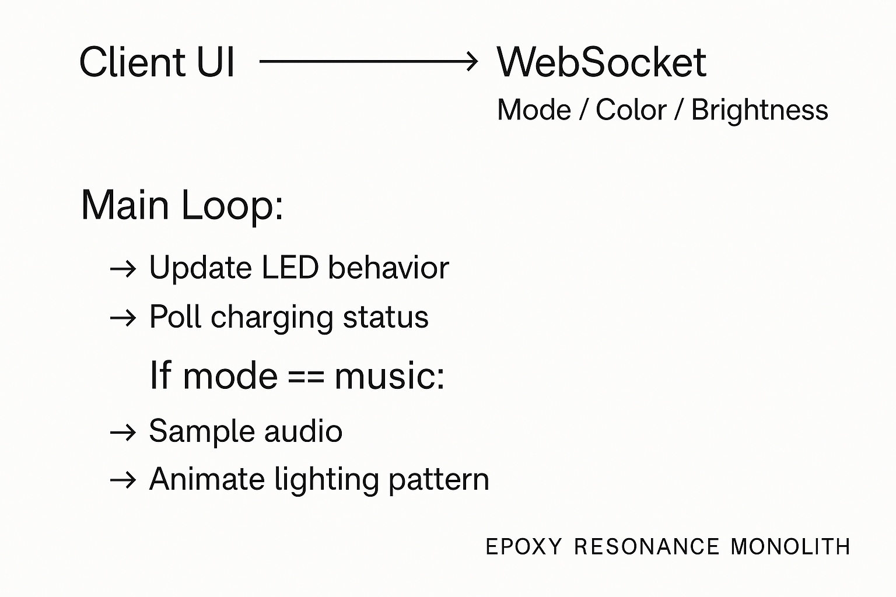

# Firmware Architecture

> © 2025 Professor. Damian A. James Williamson Grad. & Microsoft Copilot  
> Part of the *Epoxy Resonance Monolith* project. Licensed under MIT.

---

This document describes the embedded firmware system running on the ESP32 inside the cube. The firmware is modular, persistent, and designed to handle lighting effects, audio reactivity, wireless interaction, and real-time configuration.

---

## 🧩 Core Components

| Module           | Function |
|------------------|----------|
| `WiFiManager`    | Connects ESP32 to local network (from `config.h`) |
| `WebServer`      | Hosts control interface (HTML+JS) |
| `WebSocket`      | Enables live streaming of settings and sensor feedback |
| `FastLED`        | Manages WS2812 LED effects |
| `EEPROM`         | Stores user preferences: brightness, color, preset |
| `AudioInput`     | Samples MSGEQ7 or analog mic for music reactivity |

---

## 🔄 Event Flow Overview
```
Client UI → WebSocket → Mode / Color / Brightness

Main Loop:
  ↳ Update LED behavior
  ↳ Poll charging status
  ↳ If mode == music:
       → Sample audio
       → Animate lighting pattern
```

---

## 🎛️ Preset Modes

| Mode      | Behavior |
|-----------|----------|
| `static`  | Solid color display |
| `pulse`   | Breathing effect synced to time |
| `rainbow` | Rotating hue spectrum across LEDs |
| `music`   | Audio-reactive brightness/color via input |

---

## 🔮 Roadmap Ideas

- ESP32 OTA firmware update portal  
- I²S or FFT-based mic for richer spectrum feedback  
- Mobile app pairing (Progressive Web App style)  
- Touch strip input or gesture activation
