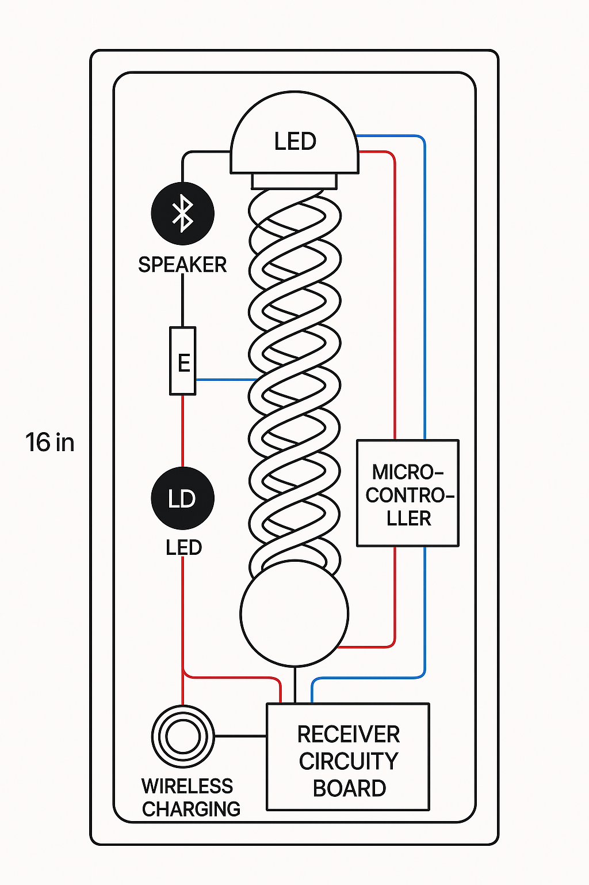

# Wiring Overview

> © 2025 Professor. Damian A. James Williamson Grad. & Microsoft Copilot  
> Part of the *Epoxy Resonance Monolith* project. Licensed under MIT.

---

This document outlines the internal wiring and component layout for the **Epoxy Resonance Monolith**. It assumes a single-piece epoxy cast with embedded electronics and wireless power.

---

## 🧠 System Stack (Vertical Slice)
```
[ Top Sphere Speaker ]
        ↓
[ LED Ring ]
        ↓
[ Quad Helix Coil ]
        ↓
[ LED Ring ]
        ↓
[ Bottom Sphere Speaker ]
        ↓
[ Wireless Charging Coil ]
[ Receiver PCB + Battery ]
```


---

## 🔌 Wiring Map

| Component              | ESP32 Pin | Description |
|------------------------|-----------|-------------|
| WS2812B LED Strip      | GPIO 5    | Addressable data line |
| Charging Status Input  | GPIO 15   | Reads HIGH when charging |
| MSGEQ7 OUT             | GPIO 34   | Analog audio level sampling |
| MSGEQ7 STROBE          | GPIO 27   | Band cycle trigger pulse |
| MSGEQ7 RESET           | GPIO 14   | Resets band scan |
| Bluetooth Audio        | —         | Internal to speaker hardware |
| Battery Pack           | VIN/GND   | 7.4V or regulated 5V input |
| Qi Coil Receiver       | 5V/GND    | Wireless charging module |

---

## 🧷 Mounting Tips

- Use acrylic rods, nylon thread, or invisible scaffolds to hold components during epoxy pour.
- Degas epoxy before casting to ensure optical clarity.
- Prefer silicone wire with translucent sheathing to blend into the structure.
- If passive bass ports are included, align them with speaker diaphragms before final mold seal.
